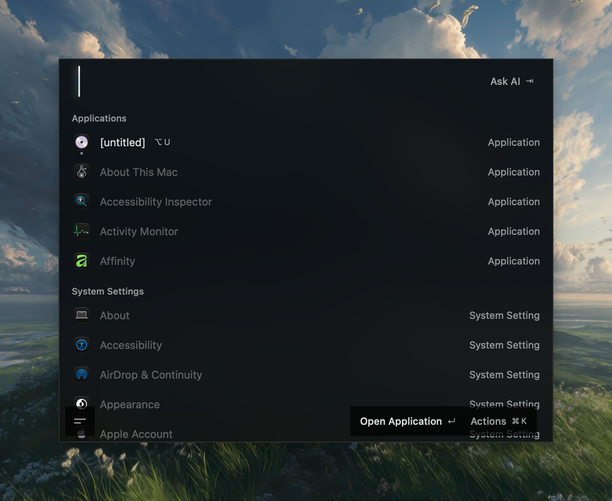

# Oz

A native macOS launcher built with SwiftUI and AppKit. Search apps, files, and commands from one keyboard-driven palette.

  

## Highlights

- **Launcher and files** — Drag file results from the launcher or File Search into other apps; refined result presentation and selection.
- **Keyboard flow** — Improved palette input, shortcuts, and navigation across screens.
- **AI chat** — Thinking status, smoother transcript scrolling, and a shortcut to chat history.
- **Quicklinks** — Improved icon rendering and caching.
- **Palette polish** — Clearer action placement, smoother menus, and blurred content behind submenus.

## Development

Requires macOS 26+ and Xcode 26. See the [development guide](docs/development.md).

## License

[AGPL-3.0](LICENSE)
